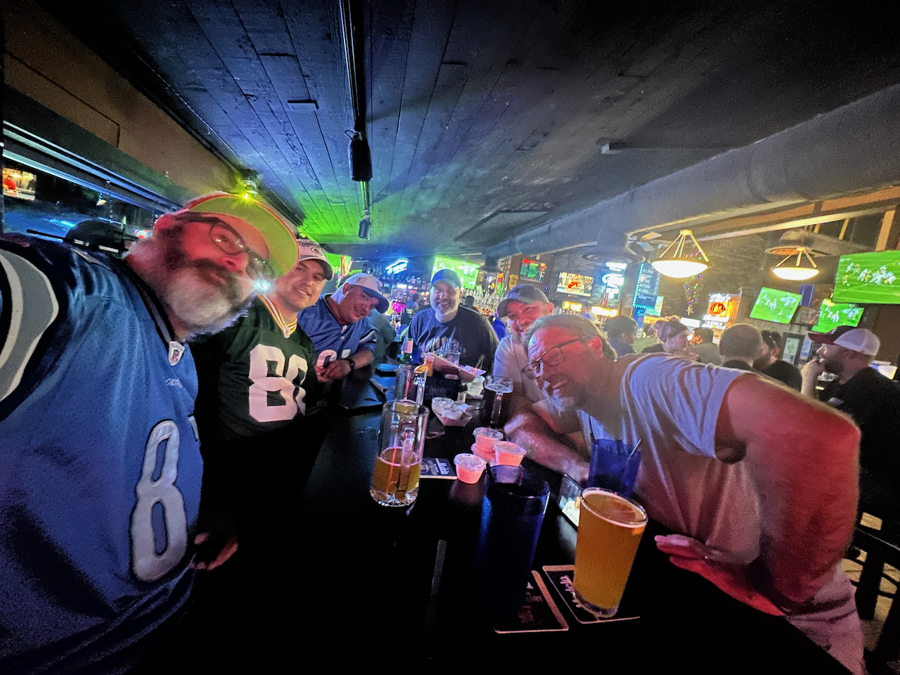

Our second yearly tradition is to go to Lambeaus's (Matt) once a year to partake in what we affectionately call "Lambopalooza"

Started off with a nice Lions victory over the Packers at Bushwood Sports Bar & Grill. Wasn't even close! The locals didn't like the Lion's fans too much :P 

In terms of actual gaming, we played a lot of Fortnite, which was a first for me... included a solo Victory Royale on my first ever game, and then 2 subsequent duos wins with Lambeaus! We got a few Trio wins with SpookieTie (Garret) and even one Quad win with ClaireBare(Matt's daughter Claire) jumping in!

The boys and I played a lot of Horde mode on Gears of War 5.  Levelling up some classes and getting some achievements.  Lambeaus, Fuzz, Ode (Dave) and DaGanstaPirate (Eric) played a lot of GTA 5:Online... there was much laughing to be had!  I don't remember much about it, other than Garret and Eric not being very good drivers

Other than that, I chilled out with some Stardew Valley again, and some Vampire Survivors... just cuz Achievements!